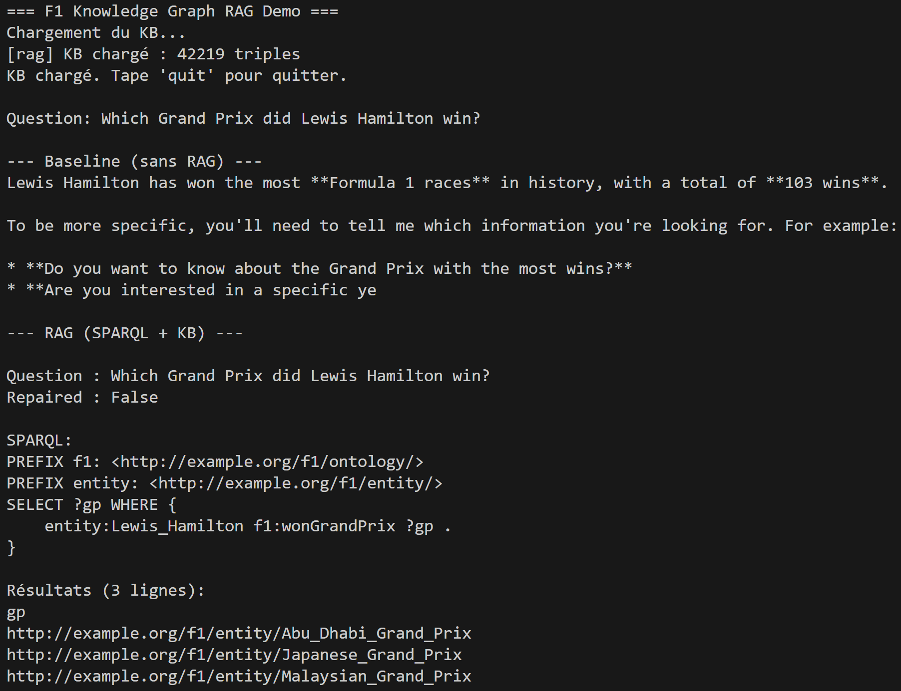
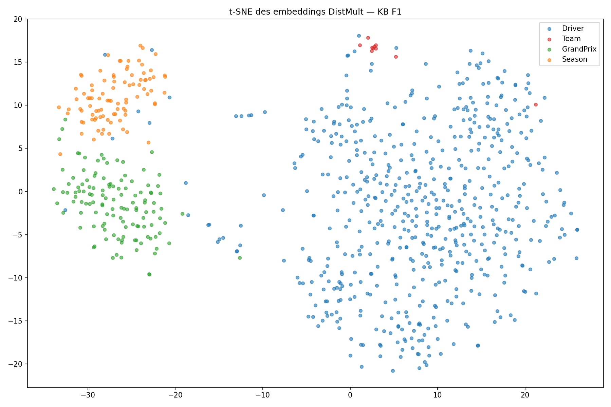

# F1 Knowledge Graph Project

A knowledge graph construction and reasoning pipeline for Formula 1 data, built as part of the Web Mining & Semantics course.

## Project Structure
```
project-root/
├── src/
│   ├── crawl/        # Web crawling and text extraction
│   ├── ie/           # Information extraction (NER + relations)
│   ├── kg/           # Knowledge graph construction and alignment
│   ├── reason/       # SWRL reasoning with OWLReady2
│   ├── kge/          # Knowledge graph embeddings with PyKEEN
│   └── rag/          # RAG pipeline with Ollama
├── data/
│   ├── raw/          # Raw HTML pages
│   ├── processed/    # Cleaned text + entity/relation CSVs
│   ├── kge/          # Train/valid/test splits
│   └── onthologies/  # OWL ontology files
├── kg_artifacts/     # Knowledge graph output files
├── notebooks/        # Jupyter notebooks for each step
├── seed_urls.txt     # Seed URLs for crawling
├── requirements.txt
└── main.py
```

## Installation

### 1. Clone the repository
```bash
git clone https://github.com/Paul-An/f1_semantic_web_project.git
cd f1_semantic_web_project
```

### 2. Create virtual environment
```bash
python -m venv .venv
.venv\Scripts\activate  # Windows
source .venv/bin/activate  # Mac/Linux
```

### 3. Install dependencies
```bash
pip install -r requirements.txt
```

### 4. Install spaCy model
```bash
python -m spacy download en_core_web_sm
```

### 5. Install Ollama (for RAG)
Download from https://ollama.com/download then pull the model:
```bash
ollama pull gemma2:2b
```

## How to Run Each Module

### Step 1 — Crawl
```python
from src.crawl.pipeline import crawl_seed_urls_and_save_manifest

records = crawl_seed_urls_and_save_manifest(
    seed_file_path="seed_urls.txt",
    manifest_output_path="data/processed/crawl_manifest.csv",
)
```

### Step 2 — Information Extraction
```python
from src.ie.pipeline import process_ie_folder

entity_df, relation_df = process_ie_folder("data/processed")
```

### Step 3 — Knowledge Graph Construction
```python
from src.kg.pipeline import build_kg_pipeline

stats = build_kg_pipeline(
    entity_csv_path="data/processed/entity_catalog.csv",
    relation_csv_path="data/processed/relation_catalog.csv",
    output_dir="kg_artifacts",
)
```

### Step 4 — Reasoning
```python
from src.reason.pipeline import run_reasoning_pipeline

stats = run_reasoning_pipeline(
    ontology_xml_path="kg_artifacts/ontology.xml",
    kb_ttl_path="kg_artifacts/full_kb.ttl",
    output_path="kg_artifacts/f1_ontology_with_rules.xml",
)
```

### Step 5 — Knowledge Graph Embeddings
```python
from src.kge.pipeline import prepare_kge_data, train_model

prepare_kge_data("kg_artifacts/full_kb.ttl", output_dir="data/kge")
metrics_transe   = train_model("TransE",   kge_dir="data/kge", epochs=50)
metrics_distmult = train_model("DistMult", kge_dir="data/kge", epochs=50)
```

### Step 6 — RAG Demo (CLI)
Make sure Ollama is running, then:
```bash
python -m src.rag.cli
```

## Hardware Requirements
- RAM: 8GB minimum (16GB recommended for KGE)
- CPU: Any modern processor (no GPU required)
- Disk: ~2GB for models and data
- Ollama: runs locally on CPU

## Screenshots

### RAG Demo


### t-SNE Embeddings


## KB Statistics
- Total triples: 42,219
- Unique entities: 7,642
- Unique predicates: 24
- Aligned entities: 475

## Notes
- The Wikidata SPARQL endpoint can be unstable — retries are built in
- KGE training takes ~5 minutes per model on CPU
- The RAG pipeline requires Ollama running on localhost:11434